# 画面の説明

デスクトップ版とウェブ版の画面を、上から順に説明します。
構造の作り方、計算条件、まとめて作る機能の順です。

**はじめて使うときは [チュートリアル](USAGE.md) から読んでください。**ここでは、画面のそれぞれの欄が何を指定するものかを説明します。

## 画面の構成

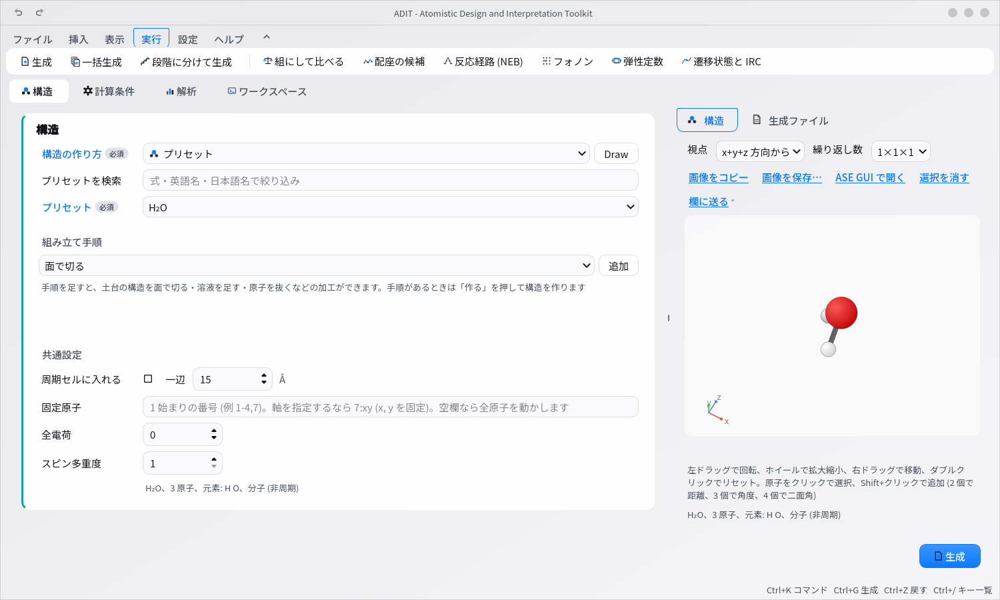

- **リボン** (Word と同じ形): 見出しを押すと、その下にボタンが群ごとに並びます。ファイル (計算設定 spec.json を開く・保存、終了)、挿入 (Draw: 分子を描く、構造ファイルの読み込み、溶液に成分を追加)、表示 (右側のタブ)、実行 (生成、1 つの条件を変えて一括生成、段階に分けて生成、まとめて作る: 比べる組・配座・反応経路・フォノン・弾性定数・遷移状態)、設定 (環境設定、言語、テーマ、ウィンドウの枠)、ヘルプ。開いている見出しをもう一度押すとリボンを畳み、見出しの列だけが残ります (見出しを押すと開きます。Ctrl+F1 でも切り替え)
- **上端**: 左に小さな「元に戻す / やり直す」(設定の履歴、Ctrl+Z / Ctrl+Shift+Z)。その下に「構造」「計算条件」「解析」「ワークスペース」の切り替えがあり、画面の左側がその内容に変わります
- **左側** (「計算条件」のとき): 2 列に分かれ、左の列に「計算の種類」「k 点」「実行環境とリソース」、右の列に「計算手法」の群が並びます (窓が狭いときは 1 列になります)。「構造」のときは構造の作り方と組み立て手順の群です
- **右側のタブ**: 構造 (マウスで回せる 3D 表示) と生成ファイル (プレビュー)。「ワークスペース」のときは隠れて、画面全体をファイル・エディタ・ターミナルに使います
- **右下**: 「生成」ボタン (Ctrl+G)。押すと出力ディレクトリに入力一式が書かれ、ワークスペースのターミナルがそこへ移動します

「必須」の印が付いた青字のラベルは必須項目、黒字は既定値のある任意項目です。最初から入っている値は、説明に出典がない限り ADIT が置いた値です。ラベルや入力欄にカーソルを合わせると、その値が何を指定するものかの短い説明が、ツールチップと画面下端に表示されます。

### 構造の作り方

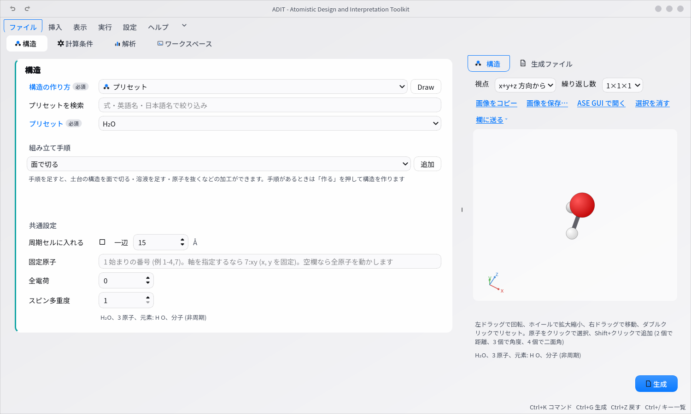

| 作り方 | 内容 |
|---|---|
| プリセット | ASE に収録された分子 (G2 セットなど) を名前で選びます |
| SMILES | 文字列から RDKit で 3D 構造を作ります。「Draw」ボタンで分子を描いて入力することもできます |
| ファイル | ASE が読める構造ファイル (xyz、cif、POSCAR、gen など) |
| バルク | 元素と結晶構造 (fcc、bcc、diamond など) から単位格子を作ります |
| スラブ | 面指数 (fcc111 など)、元素、層数、真空層から表面スラブを切り出します |
| データベースから取得 | PubChem、COD、Materials Project、OPTIMADE から名前や ID で構造を取得します (「取得」を押したときだけ通信) |
| 溶液・混合物 | 複数の分子・イオンを個数で指定し、密度または一辺で決めた立方体の周期セルに詰めます (下記) |
| 2 次元材料・ナノチューブ | グラフェン型 (C₂、BN)、MX₂ 型 (MoS₂ など)、ナノリボン、ナノチューブ。周期でない方向には真空を付けます |
| ナノ粒子 | 正二十面体・十面体・八面体・Wulff 形 (面のエネルギーから) のナノ粒子。周期のない構造です |
| ポリマー | 繰り返し単位の SMILES (つなぐ位置に `*` を 2 つ。例 `*CC*`) を重合度の数だけつないだ鎖 1 本 (H を含めて 500 原子まで)。「作る」で作ります |

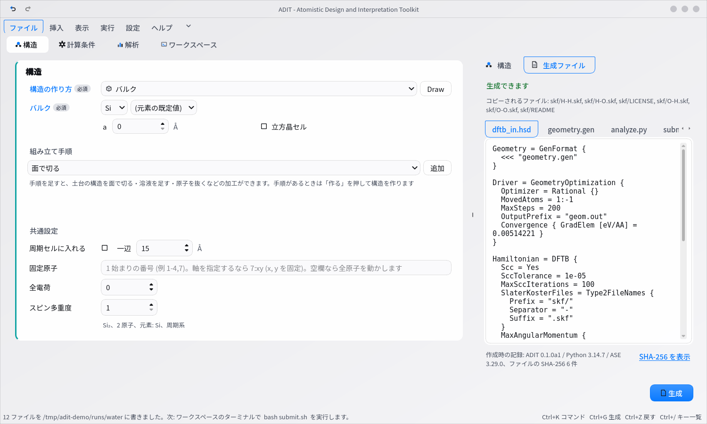

共通設定として、分子を周期セルに入れる (VASP と pw.x で必要)、固定する原子、全電荷、スピン多重度を指定します。

**組み立て手順**: 構造の群の「組み立て手順」で、土台 (上の作り方で作った構造) に加工を上から順に重ねられます。手順の種類をプルダウンで選んで「追加」、一覧の「上へ」「下へ」「削除」で並べ替えます。一覧の行を選ぶと、その手順の欄が下に出ます。

| 手順 | 内容 |
|---|---|
| 面で切る | いまのバルクを任意のミラー指数 (h k l) の面で切った板にします。層の数、真空 (片側)、どの原子面を最上面にするか (終端。1 周期の原子面の組成が一覧に出ます) |
| 溶液の層 (界面) | スラブの上に、同じ断面の溶液の層を置きます (電極と電解質の界面)。成分は溶液の表と同じ。厚みは密度からか直接指定。スラブとの隙間、上の真空 (0 なら両側が溶液)、最短距離、乱数の種。「濃度から個数」で、表で選んだ行 (イオン) の個数を濃度 [mol/L] から入れられます |
| 固定 | 下から n 層、z の範囲、元素で選んだ原子を固定します。固定の手順があるときは、共通設定の「固定原子」の欄は使いません (手順が優先) |
| 超格子 | 各軸の繰り返しか、3×3 の整数の変換行列 |
| 原子を抜く / 元素の置換 | 元素と z の範囲で選んだ原子から、個数か割合だけ無作為に抜く・置き換える (空孔、脱リチウム、ドープ)。乱数の種で再現 |
| 吸着 | 分子 1 つ (プリセット / SMILES / ファイル) を、吸着サイトの名前・原子の真上・xy 座標に、高さと下に向ける原子を決めて置きます |
| 真空層 / 直方体のセル / 溶媒和 | 軸の方向の真空、直方体の箱 (分子なら余白、結晶なら直交するセルに取り直し)、溶質を動かさずに溶媒で満たす |

手順があるときは、欄を変えるたびには作り直しません。「作る」を押すと裏で構造を作り (溶液の詰め込みは数秒、ポリマーは最大 20 秒ほど。作っている間も画面は動き、「中止」で結果を捨てられます)、手順ごとの原子数と分子どうしの最短距離を表示します。失敗したときは「手順 k (名前): …」と理由が出て、その手順の行が選ばれます。全電荷の初期値は成分の電荷の和です (吸着や置換で電荷が変わるなら欄を直してください)。spec.json には土台と手順がそのまま保存され、開くと画面に戻ります (原子座標は保存したものを使い、作り直しません)。ファイルの土台は中身の SHA-256 を控え、ファイルが変わっていたら作り直しを止めて知らせます。

**電極と電解質の界面の例** (電極の板 + C₃H₄O₃ と LiPF₆ の電解液、真空なしで板の両側が溶液): 構造の作り方を「ファイル」にして板の構造ファイルを選び (バルクから始めるなら「バルク」)、手順のプルダウンで「電極と電解質の界面 (面 + 断面の自動調整 + 溶液 + 固定)」を選んで「追加」します。面で切る (土台がすでに板なら省かれます)、断面を溶液に合わせて広げる超格子、溶液の層 (C₃H₄O₃ = SMILES `O=C1OCCO1`、Li⁺ = `[Li+]`、PF₆⁻ = `F[P-](F)(F)(F)(F)F` の 3 行、真空 0)、固定 (下の 1 層) が、この順で入ります。超格子は、各成分が周期境界で自分の像と重ならない断面になるまで a・b 方向の繰り返し数を増やします。表示される繰り返し数は下限です。個数と密度は例なので、自分の条件を入力してください (イオンの個数は「濃度から個数」でも決められます。密度から厚みを決めるときは帯の体積が総質量で変わるので、陰イオンの行を決めたあとに陽イオンの行でもう一度押します)。最後に「作る」を押します。

指定した個数と密度によっては、溶液を詰められず停止します。スラブとの隙間 `gap` は溶液帯の厚みを変えないため、詰め込み失敗の案内に表示される帯の広さと最短距離を確認してください。乱数シードによって初期配置も変わります。

**溶液・混合物**: 成分 (プリセット / SMILES / ファイル) を個数と電荷つきで表に並べます。「指定」の列は成分の種類に合わせて変わり、プリセットは分子の一覧 (H₂O のような式) から選び、SMILES は入力欄に書くかその行の「Draw」で描き、ファイルは「参照…」で選びます。セルの大きさは密度 [g/cm³] か一辺 [Å] で決め、分子間の最短距離と乱数の種も指定できます。各成分の濃度 [mol/L] と全電荷 (成分の電荷の合計) が表示されます。詰め込みは ASE と numpy だけで行い (packmol などは不要)、格子状に並べてから近すぎる分子を押し離すので、水の 1 g/cm³ のような液体の密度でも入ります。分子は剛体のまま動かすので形は変わらず、セルの境目でも切れません。同じシードなら spec.json から同じ構造が再現されます。ウェブ版とコマンドラインでは 1 行に 1 成分の書式で指定します (`H2O * 32`、`smiles:[Na+] * 1 charge=+1 label=Na+`、`file:ion.xyz * 2`)。

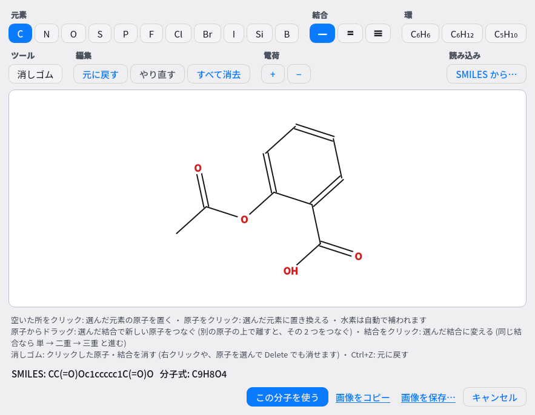

**Draw**: 構造の作り方の「Draw」ボタン (またはリボンの「挿入」、溶液の表の「Draw」) で、分子を描く画面が開きます (RDKit が必要)。
元素を選んでクリックで原子を置き、原子からドラッグで結合を伸ばします。結合のツールで単結合・二重結合・三重結合を選ぶと、原子から別の原子へのドラッグでその次数の結合でつなげます (たとえば C6H6 の環に CH3 をつなぐ)。
結合をクリックすると次数が変わり、消しゴムで原子や結合を消せます (Ctrl+Z で元に戻す)。環のテンプレート (C6H6、C6H12、C5H10)、電荷の +/− もあります。水素は自動で補われます。描いた分子は SMILES に変換され、3D 構造が生成されます。

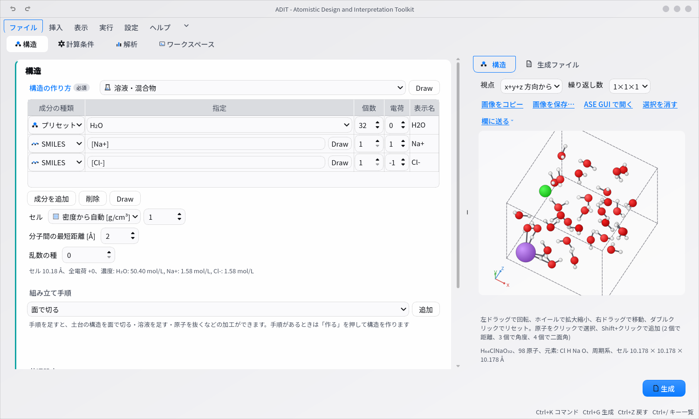

**データベースから取得**: 構造の作り方で「データベースから取得」を選び、取得元 (PubChem / COD / Materials Project / OPTIMADE) と名前か ID を入れて「取得」を押します。通信するのはこのボタンを押したときだけで、起動時や欄の変更では通信しません。

| 取得元 | 入れるもの | 返るもの | データの表記 (取得日 2026-09-19 に各サイトで確認) |
|---|---|---|---|
| PubChem | 化合物名 (例 `water`) か CID (例 `962`) | 3D 配座の SDF (3D 配座が無い化合物は「取得できません」で止まります) | NCBI の方針: 米国政府が作った情報はパブリックドメイン。提供元 (submitter) が別の条件を付けている場合があります |
| COD | COD の ID (例 `1000041`) | CIF | CC0 1.0 (パブリックドメインに献呈) |
| Materials Project | mp-ID (例 `mp-149`)。環境設定の `mp_api_key` が要ります | 構造 (JSON → extxyz に書き出し) | CC BY 4.0 (Materials Project への出典表示が要ります) |
| OPTIMADE | 組成 (例 `SiO2`) か `データベース:ID` (例 `oqmd:4061352`)。`elements HAS ALL "Si","O"` のような filter もそのまま書けます | 登録された全提供元を横断して候補を集め、選んだ 1 件の構造 (JSON → extxyz) | 提供元ごとの規約に従います (提供元のページを記録します) |

名前や組成に候補が複数あるときは一覧が出るので、使うものを選びます (どれを使うかは ADIT は判断しません)。取得した構造は「ファイル」と同じ経路で入り、3D 表示・組み立て手順・spec.json の保存もファイルと同じです。取得したファイルは `~/adit_runs/fetched/` に置き、生成した出力ディレクトリにも写します。取得元・ID・取得日時・応答の SHA-256・ライセンスは spec.json の `provenance.fetched_structure` と README.txt に記録されます。

ウェブ版も同じで、「構造の作り方」の「データベースから取得」に取得元のプルダウン、名前/ID の欄、「取得」ボタンがあります。候補が複数あるときは「候補」のプルダウンが現れるので、選んでもう一度「取得」を押します。

### 3D 表示で測る・原子を欄に送る

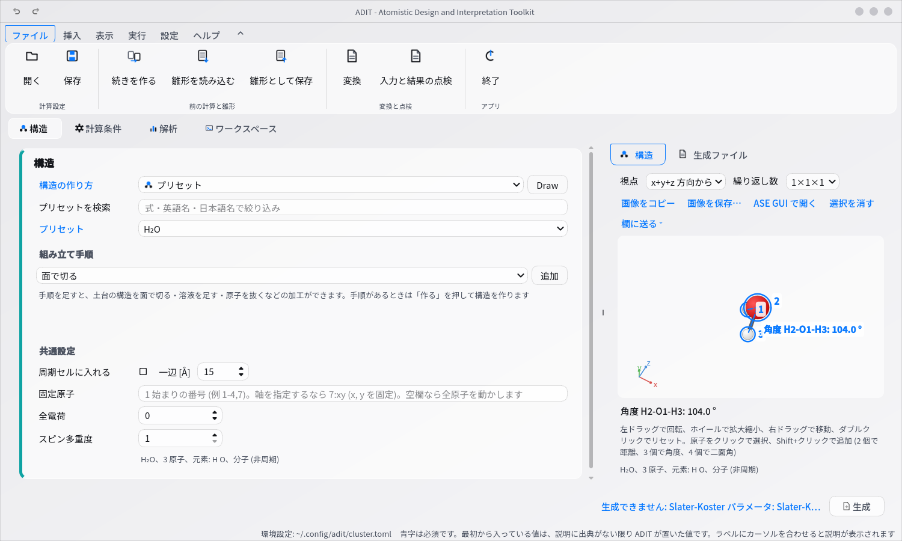

右側の「構造」タブの 3D 表示で、原子をクリックすると選べます (Shift+クリックで追加、もう一度 Shift+クリックで外す、何もない所をクリックで解除)。
2 個選ぶと距離 [Å]、3 個で角度 [度] (2 番目の原子を頂点)、4 個で二面角 [度] が、絵の上と絵の下の行に出ます。
周期系では最も近い像との距離で測ります (繰り返し数を 2×2×2 などにしていても同じ)。

「欄に送る」で、選んだ原子の番号 (1 始まり) を次の欄に入れられます。

| 送り先 | 入る形 | 使い所 |
|---|---|---|
| 固定原子の欄 | `1-2,7` (既にある番号と合わせて並べ直す。`7:xy` のような軸の指定はそのまま残る) | 構造最適化や MD で動かさない原子 |
| 解析の「原子の選び方」 | `index 1,3` (別の式が入っていれば `… or index 1,3`) | RDF・MSD・配位数などを一部の原子だけで |
| 解析の時系列の欄 | 2 個なら距離、3 個なら角度、4 個なら二面角の欄に `2,1,3` (クリックした順) | 結合長や角度の時間変化 |

繰り返して表示している周期系では、番号は基本セルのものに直します (同じ原子の像を 2 つ選ぶと、その旨が出ます)。

ウェブ版の「構造 (3D)」でも同じように測れます (送り先は固定原子の欄だけ。解析ページの欄には、表示された番号を貼ります)。

### 計算の準備: 溶媒、磁性と DFT+U、前の計算の続き、段階に分けた計算、研究室の雛形

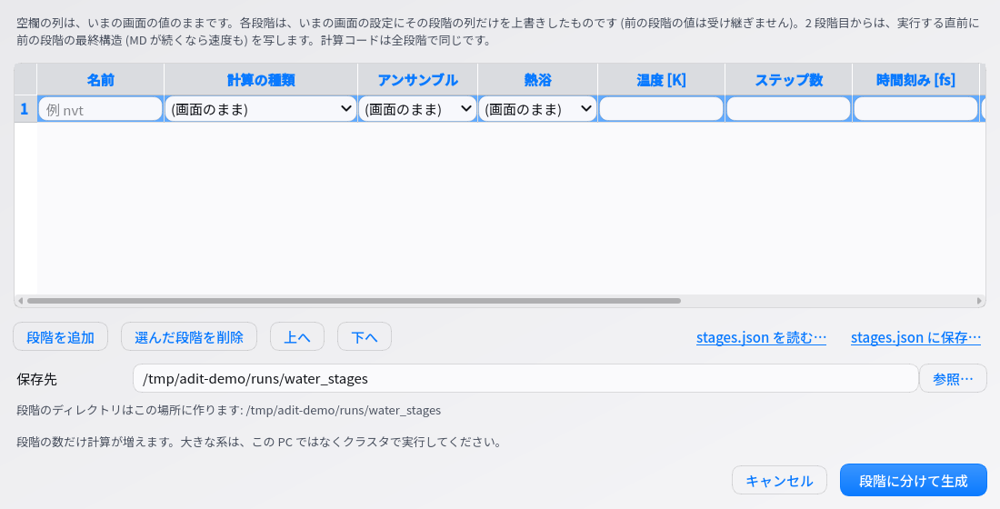

ADIT は、溶媒・U の値・段階の組み方などを推奨しません。欄の既定値は計算コード自身の既定か「指定しない」です。

**溶媒** (計算手法の群):

| 計算コード | 欄 | 書かれるもの |
|---|---|---|
| xtb | 溶媒モデル (なし / ALPB / GBSA) と溶媒 | `--alpb <溶媒>` / `--gbsa <溶媒>`。溶媒の候補は、モデルと計算手法 (GFN1 / GFN2 / GFN-FF) で xtb が受け付ける名前だけ。GFN0-xTB では使えません |
| ORCA | 溶媒モデル (なし / CPCM / SMD) と溶媒 | `! CPCM(<溶媒>)` / `! SMD(<溶媒>)`。候補は ORCA 6.1 マニュアルの溶媒の表 |
| DFTB+ | 溶媒のパラメータファイル (GBSA) | `Solvation = GeneralisedBorn { ParamFile }`。`param_gbsa_<溶媒>.txt` の形のファイルを指定します。分子 (非周期) だけ |
| CP2K | 溶媒の比誘電率 (SCCS) | `&SCCS` の `RELATIVE_PERMITTIVITY`。0 なら溶媒なし |

**元素ごとの初期磁気モーメントと DFT+U** (VASP・Quantum ESPRESSO・CP2K): 元素ごとの欄 (VASP は MAGMOM を POSCAR の原子の順に展開、QE は `starting_magnetization`、CP2K は KIND の `MAGNETIZATION`。空欄は指定しない) と、DFT+U の表 (行ごとに元素・殻・U [eV]・J [eV]) があります。表の元素はいまの構造にあるものだけを選べ、U に既定値はありません。形式は VASP が LDAUTYPE、QE が HUBBARD の射影 (QE の生成器は J を書かないので J の列はありません)、CP2K が PLUS_U_METHOD で選びます。

**前の計算の続き**: リボンの「ファイル」→「続きを作る」で、ADIT が生成して実行したディレクトリを選びます。その最終構造 (MD なら速度も) から始める計算が画面に読み込まれ、引き継いだもの・引き継がないものの一覧が出ます。「速度を引き継ぐ」を外すと新しく初速を作ります。「計算の条件はいまの画面の値を使う」に印を付けると、構造 (と速度) だけを前の計算から取ります。

| 計算コード | MD の続きで引き継ぐもの |
|---|---|
| DFTB+・VASP | 位置と速度 |
| xtb | 位置と `mdrestart` (座標と速度) |
| CP2K | 位置・セルと restart (速度)。熱浴・圧力浴の状態は引き継ぎません |
| LAMMPS | `final.data` (位置と速度) |
| GROMACS | `adit.gro` と `adit.cpt` (速度と熱浴・圧力浴の状態) |
| Quantum ESPRESSO・ORCA | 位置 (とセル) だけ。速度は出力に書かれないので引き継げません |

続きの状態は「生成ファイル」タブに小さく出ます (「外す」で捨てられます)。計算の種類を MD 以外にしたり計算コードを変えたりすると、速度と写すファイルは使いません。出力ディレクトリは前の計算とは別の場所にしてください。

**段階に分けた計算**: リボンの「実行」→「段階に分けて生成」(「1 つの条件を変えて一括生成」の隣) で、段階の表 (名前・計算の種類・アンサンブル・熱浴・温度・ステップ数・時間刻み・圧力・速度・ほかの項目) を編集します。空欄の列はいまの画面の値のままで、前の段階の値は受け継ぎません。保存先に `stage_01_<名前>/` … と、段階を順に実行する `submit.sh`、クラスタで依存付きで投入する例を書いた `README.txt`、段階の一覧 `stages.json` を作ります。2 段階目からの `submit.sh` は、実行する直前に前の段階の最終構造 (MD が続くなら速度も) を写します。表は `stages.json` として保存・読み込みできます。

**研究室の雛形**: 雛形は構造を除いた `spec.json` です。リボンの「ファイル」→「雛形として保存」でいまの設定を保存し、「雛形を読み込む」で一覧から選ぶと、構造はそのままで条件だけが雛形の値になります。雛形の値のままの欄には、ラベルの下に「雛形 xx の値」と小さく出ます (値を変えると消えます)。置き場所は環境設定の「研究室の雛形」(`templates_dir`) と、環境設定ファイルと同じ場所の `templates/` です。

**作成時の記録**: 「生成ファイル」タブの下に、ADIT・Python・ASE のバージョンと、写したパラメータファイルの数が小さく出ます。「SHA-256 を表示」で、ファイルごとの SHA-256 (中身から計算する照合用のハッシュ。同じ値なら同じファイル) を確かめられます。同じものが `spec.json` の `provenance` と `README.txt` にも書かれます。

ウェブ版では、同じ欄が計算手法の群に、「段階に分けて生成」「前の計算の続きを作る」「研究室の雛形」が一括生成の欄の下にあります (前の計算のディレクトリはパスで入れます)。

コマンドラインでは次のように使います。

```bash
adit-gen --continue-from runs/nvt/ runs/nvt2/                   # 前の計算の続き (条件も前のまま)
adit-gen --continue-from runs/nvt/ npt.json runs/npt/           # 条件は npt.json、構造と速度は前の計算から
adit-gen --continue-from runs/nvt/ runs/nve/ --no-velocities    # 速度を引き継がない
adit-gen spec.json runs/staged/ --stages stages.json            # 段階に分けて生成
adit-gen spec.json --save-template lab-md                        # spec.json から構造を除いて雛形として保存
adit-gen --list-templates                                        # 雛形の一覧
adit-gen spec.json runs/x/ --template lab-md                     # 条件は雛形、構造は spec.json から
```

`stages.json` の形 (段階の数・温度・ステップ数は自分で決めます):

```json
{"stages": [
  {"name": "min", "task": {"type": "geometry_optimization", "max_steps": 200}},
  {"name": "nvt", "task": {"type": "molecular_dynamics", "md": {"ensemble": "NVT", "temperature_k": 300, "steps": 50000}}},
  {"name": "prod", "task": {"type": "molecular_dynamics", "md": {"ensemble": "NVE"}}, "velocities": true}
]}
```

### 計算をまとめて作る: 比べる組・配座・反応経路・フォノン・弾性定数・遷移状態

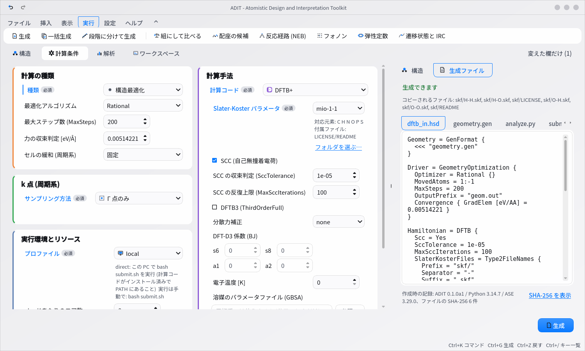

配座の候補と反応経路 (NEB) の画面です。

| 配座の候補 | 反応経路 (NEB) |
|---|---|
| 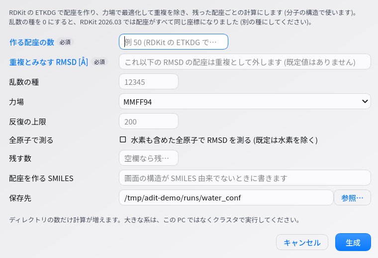 | 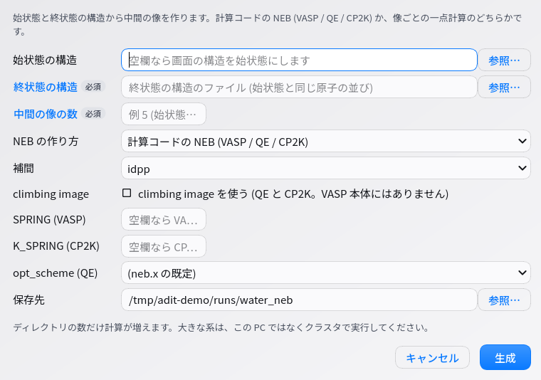 |

リボンの「実行」の「まとめて作る」に 6 つのボタンがあります (ウェブ版では「まとめて作る」の折りたたみの欄で、上のプルダウンから選びます)。
どれも**いまの画面の条件をそのまま使い**、変えるのは下の表の欄だけです。ADIT は値を勧めません (既定値のある欄は、その計算コードやパッケージの既定です)。

| 作るもの | 入れる値 | 実行したあと |
|---|---|---|
| 比べる計算の組 | 組の種類 (吸着 / 反応 / 溶媒和) と、各計算の構造のファイル・係数 ν・電荷。組の定義を書いた `set.json` を指定することもできます | 解析の「組にして比べる」で基準のディレクトリにその場所を入れます (`compare.json` を読みます)。CLI は `adit-analyze <out> --compare` |
| 配座の候補 | 作る配座の数、重複とみなす RMSD [Å] (必須。既定値なし)、乱数の種、力場、残す数 | 解析でそのディレクトリを開くと、配座ごとのエネルギーの表と図 (`scan.json`) |
| 反応経路 (NEB) | 終状態の構造 (必須)、中間の像の数 (必須)、作り方 (計算コードの NEB / 像ごとの一点計算)、補間、climbing image、SPRING・K_SPRING・opt_scheme | 解析でそのディレクトリを開くとエネルギーの曲線と障壁 (像ごとの一点計算なら表と図) |
| フォノン (有限変位) | 超格子の倍率 (必須)、変位の大きさ、変位の作り方 (phonopy / ASE)、DOS の q 点のメッシュと幅 | `python <out>/phonon_collect.py` で力を集めてから、解析でそのディレクトリを開きます |
| 弾性定数 (歪み) | 歪みの大きさ (必須。カンマ区切り)、歪みを与える成分 (Voigt 記法の番号) | `python <out>/elastic_collect.py` で応力を集め、`elastic_constants.csv` を書きます |
| 遷移状態と IRC | 作るもの (ORCA の OptTS / IRC / 段階に分けた両方、または ASE + Sella のスクリプト) | ORCA は段階ごとに実行します。Sella は `pip install ase sella <calculator のパッケージ>` を入れてから `bash submit.sh` |

生成すると、作ったディレクトリの一覧と「次にすること」が出ます。保存先が空でなければ上書きの確認をします。

**ORCA の遷移状態と IRC** は、計算手法の群の欄でも書けます。計算の種類が構造最適化のときに「遷移状態の探索 (OptTS)」を入れると `! OptTS`、一点計算のときに「反応座標をたどる (IRC)」を入れると `! Freq IRC` になります (最初のヘシアン `Calc_Hess`、計算し直す間隔 `Recalc_Hess`、最後の `Freq`、IRC の反復の上限と向きも欄にあります)。両方を続けて実行するときは「まとめて作る」の「遷移状態と IRC」で段階に分けて生成します (ORCA 6.1 のマニュアルで 1 つのジョブにまとめる形を確かめていないため)。

**機械学習ポテンシャル**は計算コードのプルダウンから選びます。種類 (MACE-MP / MACE-OFF / CHGNet)、モデル、device、dtype、D3 (mace_mp のみ)、乱数の種を指定します。入力の代わりに `run_mlip.py` (ASE) と `mlip_settings.json`、`structure.extxyz` が書かれ、実行する環境に入れるパッケージ (`pip install ase mace-torch` など) が画面に 1 行出ます。全電荷とスピン多重度は使わず (0 と 1 のまま)、k 点の群は出ません。

**文書に書かれた値**: カットオフなどの欄の下に、使うパラメータのファイルに書かれている値が「ファイル名:行番号 の記載: …」の形で小さく出ます (pw.x の UPF と SSSP の JSON、VASP の POTCAR の ENMAX / ENMIN、CP2K の基底と擬ポテンシャルの注釈、DFTB+ の README の Hubbard 微分・ζ・D3 係数と spinw.txt)。**ADIT の推奨ではありません。**単位が欄と同じときだけ「入れる」が出て、押したときだけ欄に入ります。文書に何も書かれていなければ何も出ません。

コマンドラインでは次のように使います (詳しい書式は `adit-gen --help`)。

```bash
adit-gen spec.json out/ --compare-set set.json          # 比べる計算の組 (吸着・反応・溶媒和)
adit-gen spec.json out/ --conformers 50 --rmsd 0.5      # 配座の候補
adit-gen spec.json out/ --neb start.xyz end.xyz --images 5
adit-gen spec.json out/ --phonons 2x2x2                 # フォノン (実行したあと python out/phonon_collect.py)
adit-gen spec.json out/ --elastic=-0.01,0.01            # 弾性定数 (実行したあと python out/elastic_collect.py)
adit-gen spec.json out/ --ts ts+irc                     # ORCA の OptTS → IRC を段階に分けて
adit-gen spec.json out/ --sella                         # ASE + Sella のスクリプト (xtb・機械学習ポテンシャル)
adit-gen spec.json --documented                         # 文書に書かれた値を出典付きで並べる
```

### 生成 → 実行 → 解析

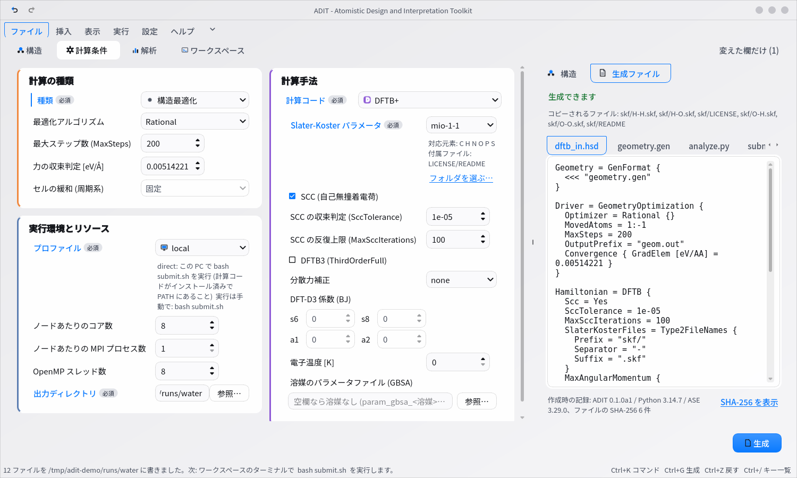

1. **生成**: 出力ディレクトリに入力ファイル一式、`submit.sh`、`spec.json`、`README.txt`、`analyze.py` が書かれます。空でないディレクトリには上書きの確認があります。
2. **実行**: ワークスペースのターミナルで `bash submit.sh`。クラスタなら `transfer_and_submit.sh` のコマンドで転送し、`qsub submit.sh` または `sbatch submit.sh` で投入します。手順は各ディレクトリの `README.txt` にも書かれています。
3. **解析**: 「解析」タブで計算結果のディレクトリを指定して「解析を実行」。生成したフォルダは自動で入っています。
4. **再生**: 解析のあと、要約の下の「3D で再生」に、MD の軌跡・構造最適化の各ステップ・振動モードを動かす 3D 表示が出ます。スライダーと再生・コマ送りのボタンで動かし、下のグラフ (エネルギー・温度の推移、または振動数) の縦線がフレームに追従します。グラフをクリックするとそのフレーム (振動なら最も近いモード) に飛びます。詳しくは [解析の詳細](ANALYSIS.md) の「3D で再生」。

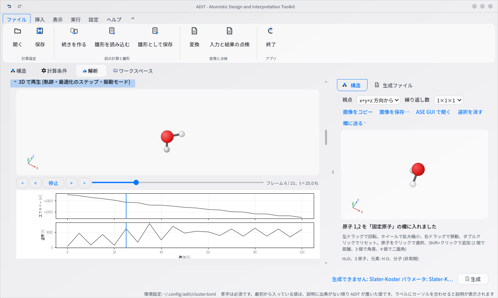

5. **等値面**: 計算結果のディレクトリに cube や CHGCAR・PARCHG・LOCPOT があると、要約の下に「等値面」の枠が出ます。ファイルを選ぶと値の最小・最大が出るので、等値を自分で入れて「表示」を押すと、その面が原子の上に半透明で描かれます (正と負で色を分けます。既定の等値はありません)。三角形が多すぎるときは間引きを提案します。詳しくは [解析の詳細](ANALYSIS.md) の「等値面」。

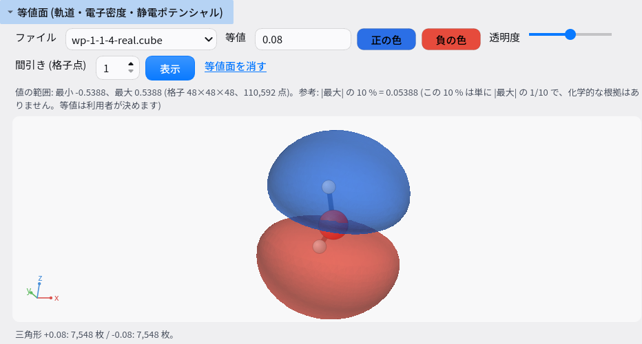

(上の絵の軌道は、画面の説明のために作った関数で、計算の結果ではありません)
